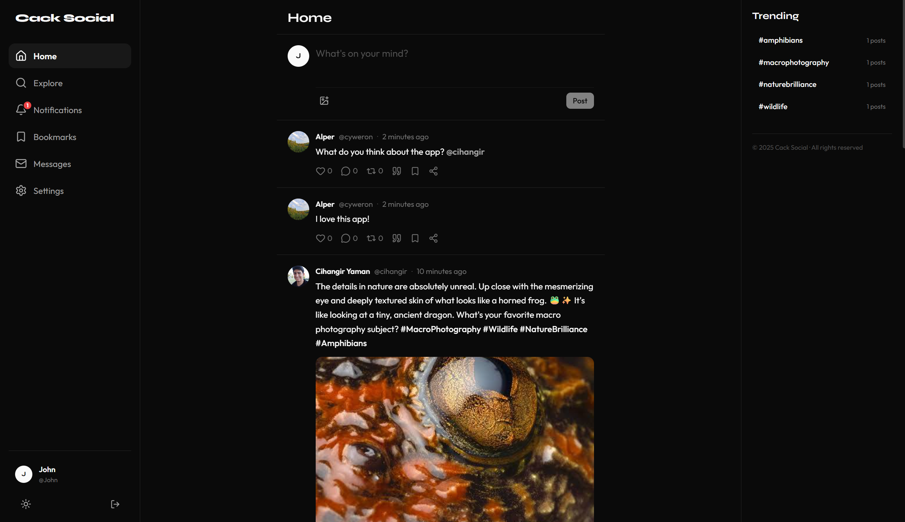
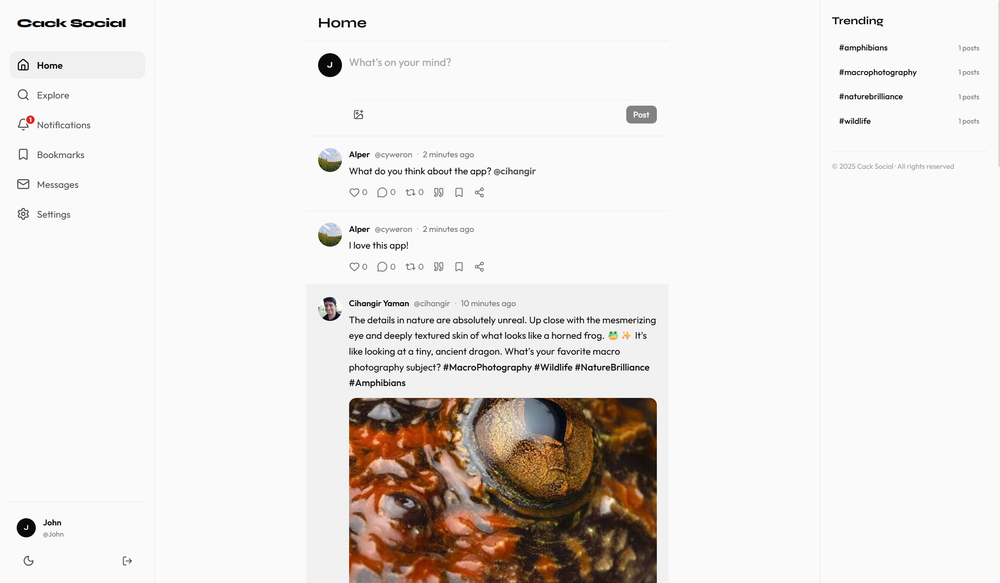
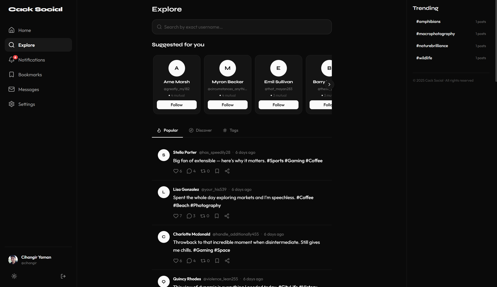
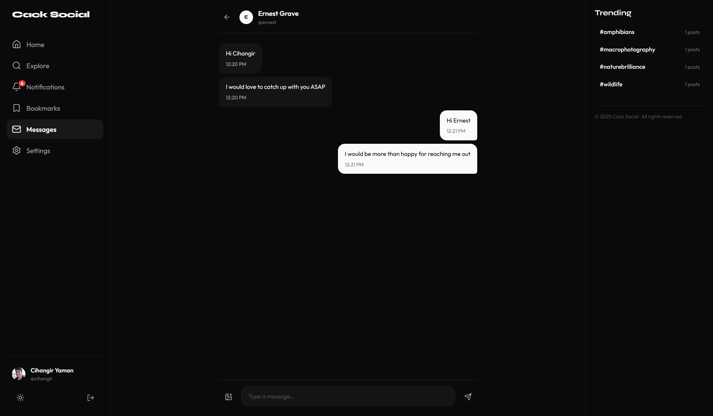
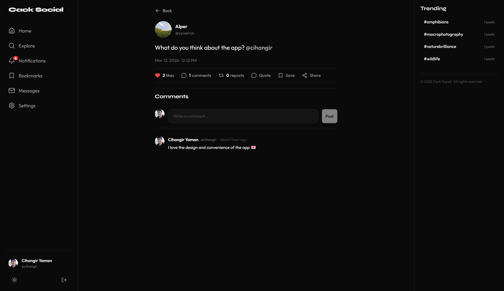
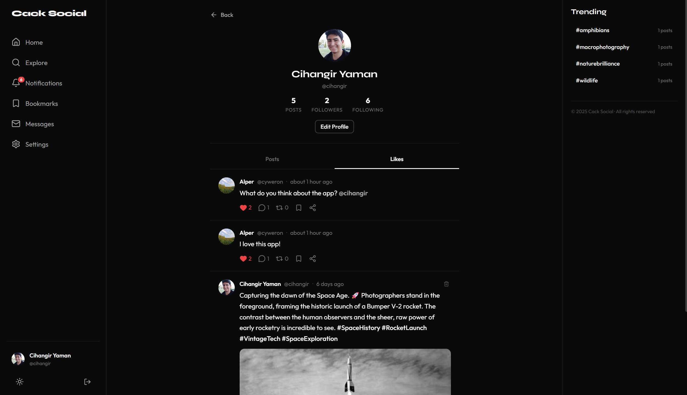

# Cack Social — Web Client

The React front-end for **Cack Social**, a lightweight social networking platform built for real-time content sharing and interpersonal connections. This client powers the full user experience: posts, timelines, direct messaging via WebSocket, notifications, bookmarks, explore/discover feeds, and user profiles—all wrapped in a distinctive, theme-aware interface.

## Key Features

- **Timeline & Posts** — Text + image posts with hashtag extraction, likes, comments, reposts, and quote posts
- **Real-time Direct Messaging** — WebSocket-powered chat with image support and read receipts
- **Explore & Discover** — Popular posts, discover feed, suggested users with mutual-follower counts
- **Notifications** — Real-time (via WebSocket) and paginated notification feed with unread badges
- **Bookmarks** — Save and browse bookmarked posts
- **User Profiles** — Follow/unfollow, avatar uploads, bio editing, follower/following counts
- **Dark / Light Theme** — System-preference-aware with manual toggle, persisted in `localStorage`
- **Infinite Scroll** — IntersectionObserver-based pagination across all feed views
- **Responsive Layout** — Desktop sidebar + right panel, mobile bottom nav

---

## Table of Contents

- [Tech Stack](#tech-stack)
- [Prerequisites](#prerequisites)
- [Getting Started](#getting-started)
- [Project Structure](#project-structure)
- [Architecture](#architecture)
- [Environment Variables](#environment-variables)
- [Available Scripts](#available-scripts)
- [API Layer](#api-layer)
- [State Management](#state-management)
- [Styling & Theming](#styling--theming)
- [Routing](#routing)
- [Testing](#testing)
- [Adding a New Feature](#adding-a-new-feature)
- [Troubleshooting](#troubleshooting)

---

## Screenshots

 
 
 

---

## Tech Stack

| Category | Technology |
|---|---|
| **Language** | TypeScript 5.9 (strict mode) |
| **Framework** | React 19 |
| **Build Tool** | Vite 7 |
| **Routing** | React Router DOM 7 |
| **State Management** | Zustand 5 |
| **Icons** | Lucide React |
| **Date Formatting** | date-fns 4 |
| **Testing** | Vitest 4 + Testing Library (React + User Event) + jsdom |
| **Linting** | ESLint 9 + typescript-eslint + react-hooks + react-refresh |
| **Styling** | CSS Modules + CSS Custom Properties (no UI library) |
| **Fonts** | Syne (display) + Outfit (body) via Google Fonts |

---

## Prerequisites

- **Node.js** 20 or higher
- **npm** 10+ (ships with Node 20)
- **Cack Backend** running on `http://localhost:8080` (see [cack-backend](https://github.com/CackSocial/cack-backend))

---

## Getting Started

### 1. Clone the Repository

```bash
git clone <repo-url>
cd cack-frontend-web
```

### 2. Install Dependencies

```bash
npm install
```

### 3. Configure the Backend

The Vite dev server proxies `/api` and `/uploads` to `http://localhost:8080` by default (configured in `vite.config.ts`). If your backend runs on a different host, set the environment variables (see [Environment Variables](#environment-variables)).

Make sure the Cack backend is running:

```bash
# In the cack-backend directory
docker compose up -d --build
# or
make run
```

### 4. Start the Dev Server

```bash
npm run dev
```

Open [http://localhost:5173](http://localhost:5173) in your browser.

### 5. Create an Account

Navigate to `/register`, pick a username, display name, and password — you're in.

---

## Project Structure

```
cack-frontend-web/
├── index.html                  # Entry HTML — loads Google Fonts (Syne + Outfit)
├── vite.config.ts              # Vite config: React plugin, dev proxy, Vitest setup
├── tsconfig.json               # TypeScript project references
├── tsconfig.app.json           # App TS config (strict, ES2022, react-jsx)
├── tsconfig.node.json          # Node-side TS config (Vite config files)
├── eslint.config.js            # Flat ESLint config
├── package.json                # Dependencies & scripts
├── public/                     # Static assets (favicon, etc.)
└── src/
    ├── main.tsx                # React root mount + theme hydration
    ├── App.tsx                 # Router definition (all routes)
    ├── vite-env.d.ts           # Vite client types
    ├── api/                    # API service layer
    │   ├── client.ts           # Fetch wrapper (get/post/put/del), auth headers, CSRF
    │   ├── types.ts            # Backend snake_case response interfaces
    │   ├── mappers.ts          # snake_case → camelCase mappers
    │   ├── ws.ts               # WSClient class for WebSocket (DMs + notifications)
    │   ├── auth.ts             # login, register, logout
    │   ├── posts.ts            # timeline, CRUD, user posts
    │   ├── comments.ts         # get/create/delete comments
    │   ├── likes.ts            # like/unlike
    │   ├── follows.ts          # follow/unfollow, followers/following lists
    │   ├── messages.ts         # conversations, send message
    │   ├── bookmarks.ts        # bookmark/unbookmark, list bookmarks
    │   ├── reposts.ts          # repost/unrepost, quote post
    │   ├── tags.ts             # trending tags, posts by tag
    │   ├── notifications.ts    # notifications CRUD, unread count
    │   ├── explore.ts          # suggested users, popular posts, discover feed
    │   └── users.ts            # profile, update profile, user lookup
    ├── stores/                 # Zustand stores
    │   ├── authStore.ts        # User session, login/register/logout
    │   ├── postsStore.ts       # Timeline, CRUD, likes, bookmarks, reposts
    │   ├── messagesStore.ts    # Conversations, WS lifecycle, send/receive
    │   ├── notificationsStore.ts # Notifications, unread count, mark read
    │   ├── exploreStore.ts     # Suggested users, popular/discover feeds
    │   ├── themeStore.ts       # Light/dark theme toggle
    │   ├── toastStore.ts       # Toast notification queue
    │   └── __tests__/          # Store unit tests
    ├── types/
    │   └── index.ts            # Frontend domain types (camelCase)
    ├── components/
    │   ├── common/             # Reusable UI primitives
    │   │   ├── Avatar.tsx
    │   │   ├── Badge.tsx
    │   │   ├── Button.tsx
    │   │   ├── ConfirmDialog.tsx
    │   │   ├── IconButton.tsx
    │   │   ├── ImageViewer.tsx
    │   │   ├── Input.tsx
    │   │   ├── Modal.tsx
    │   │   ├── Skeleton.tsx
    │   │   ├── SuggestedUserCard.tsx
    │   │   ├── Textarea.tsx
    │   │   ├── MentionAutocomplete/
    │   │   └── Toast/
    │   ├── layout/             # App shell
    │   │   ├── AppLayout.tsx   # Sidebar + content + right panel + mobile nav
    │   │   ├── Sidebar.tsx     # Desktop navigation
    │   │   ├── RightPanel.tsx  # Trending tags, suggestions
    │   │   └── MobileNav.tsx   # Bottom navigation bar
    │   ├── post/               # Post-related components
    │   │   ├── PostCard.tsx    # Post display (text, image, repost, quote)
    │   │   ├── PostComposer.tsx # New post form with image upload
    │   │   ├── CommentThread.tsx
    │   │   └── __tests__/
    │   └── theme/
    │       └── ThemeToggle.tsx  # Dark/light mode switch
    ├── pages/                  # Route-level page components
    │   ├── HomePage/           # Timeline feed
    │   ├── ProfilePage/        # User profile + posts
    │   ├── PostDetailPage/     # Single post + comments
    │   ├── ExplorePage/        # Discover feed, popular posts, suggestions
    │   ├── MessagesPage/       # Conversation list
    │   ├── ConversationPage/   # Individual DM thread
    │   ├── NotificationsPage/  # Notification feed
    │   ├── BookmarksPage/      # Saved posts
    │   ├── SettingsPage/       # Profile editing, account deletion
    │   ├── LoginPage/          # Login form
    │   └── RegisterPage/       # Registration form
    ├── hooks/
    │   ├── useInfiniteScroll.ts # IntersectionObserver-based infinite pagination
    │   └── useDebounce.ts       # Debounced value hook
    ├── utils/
    │   ├── format.ts           # timeAgo, formatCount, truncate
    │   ├── renderTaggedContent.tsx # Renders #hashtags as clickable links
    │   ├── share.ts            # Web Share API with clipboard fallback
    │   └── __tests__/
    ├── data/
    │   └── mockData.ts         # Seed/mock data for development
    ├── styles/
    │   ├── variables.css       # Design tokens: colors, spacing, typography, radii
    │   ├── reset.css           # CSS reset + global element styles
    │   └── global.css          # Animations, accessibility utilities
    └── test/
        ├── setup.ts            # Vitest setup (jest-dom matchers)
        └── smoke.test.ts       # Smoke test
```

---

## Architecture

### Data Flow

```
User Interaction
  → React Component (page/component)
    → Zustand Store action (optimistic update)
      → API service function (src/api/*.ts)
        → fetch() via client.ts (attaches JWT + CSRF)
          → Vite proxy → Backend (localhost:8080)
            → JSON response (snake_case)
              → Mapper function (src/api/mappers.ts)
                → Frontend domain type (camelCase)
                  → Zustand state update
                    → React re-render
```

### Key Architectural Decisions

**Strict Layer Separation**

The API layer (`src/api/`) is the only code that talks to the backend. It consists of three sub-layers:

1. **`client.ts`** — Low-level fetch wrapper. Handles auth headers (`Authorization: Bearer`), CSRF tokens, `FormData` detection, error toast side-effects, and the `VITE_API_BASE_URL` env var.
2. **`types.ts`** — Raw backend response shapes in `snake_case`. These are never used in components directly.
3. **`mappers.ts`** — Pure functions that transform backend types into frontend `camelCase` domain types. Also normalizes image URLs from absolute to relative paths so they pass through the Vite proxy.

**Zustand for State**

Each feature domain has its own Zustand store. Stores call API functions, run mappers, and manage loading/error states. Components subscribe to store slices via selector functions for minimal re-renders.

**Optimistic Updates**

`toggleLike`, `toggleBookmark`, `toggleRepost`, `markAsRead`, `follow/unfollow` all apply state changes immediately and revert on API failure, paired with a toast notification on error.

**WebSocket Integration**

The `WSClient` class (`src/api/ws.ts`) connects on auth and receives two event types:
- `message` — new DM, routed to `messagesStore`
- `notification` — new notification, routed to `notificationsStore`

The connection is initialized in `AppLayout` when the user authenticates and persists across route changes.

**Code Splitting**

All page components are lazy-loaded via `React.lazy()` with a `<Suspense>` fallback, keeping the initial bundle small.

---

## Environment Variables

The app reads environment variables via Vite's `import.meta.env`:

| Variable | Description | Default |
|---|---|---|
| `VITE_API_BASE_URL` | Base URL for REST API calls | `/api/v1` (proxied to `localhost:8080`) |
| `VITE_WS_BASE_URL` | Base URL for WebSocket connection | `ws://localhost:8080/api/v1` |

For local development with the default Vite proxy, **no env vars are needed**. The proxy in `vite.config.ts` forwards `/api` and `/uploads` to `http://localhost:8080`.

For production or custom setups, create a `.env.local` file:

```env
VITE_API_BASE_URL=https://api.example.com/api/v1
VITE_WS_BASE_URL=wss://api.example.com/api/v1
```

### Local Storage Keys

| Key | Purpose |
|---|---|
| `sc-token` | JWT auth token |
| `sc-user` | Serialized user object (JSON) |
| `sc-theme` | Theme preference (`light` or `dark`) |

---

## Available Scripts

| Command | Description |
|---|---|
| `npm run dev` | Start Vite dev server with hot reload (default: port 5173) |
| `npm run build` | Type-check with `tsc` then build production bundle to `dist/` |
| `npm run preview` | Serve the production build locally for testing |
| `npm run lint` | Run ESLint across all `.ts` and `.tsx` files |
| `npm test` | Run Vitest in watch mode |
| `npm run test:run` | Run Vitest once (CI-friendly, exits after completion) |

---

## API Layer

All backend communication goes through `src/api/`. Each file corresponds to a feature domain:

| File | Endpoints |
|---|---|
| `auth.ts` | `POST /auth/login`, `POST /auth/register`, `POST /auth/logout` |
| `posts.ts` | `GET /timeline`, `GET /posts/:id`, `GET /users/:username/posts`, `POST /posts`, `DELETE /posts/:id` |
| `comments.ts` | `GET /posts/:id/comments`, `POST /posts/:id/comments`, `DELETE /comments/:id` |
| `likes.ts` | `POST /posts/:id/like`, `DELETE /posts/:id/like` |
| `follows.ts` | `POST /users/:username/follow`, `DELETE /users/:username/follow`, `GET /users/:username/followers`, `GET /users/:username/following` |
| `messages.ts` | `GET /messages/conversations`, `GET /messages/:username`, `POST /messages/:username` |
| `bookmarks.ts` | `POST /posts/:id/bookmark`, `DELETE /posts/:id/bookmark`, `GET /bookmarks` |
| `reposts.ts` | `POST /posts/:id/repost`, `DELETE /posts/:id/repost`, `POST /posts/:id/quote` |
| `tags.ts` | `GET /tags/trending`, `GET /tags/:name/posts` |
| `notifications.ts` | `GET /notifications`, `PUT /notifications/:id/read`, `PUT /notifications/read-all`, `GET /notifications/unread-count` |
| `explore.ts` | `GET /explore/suggested-users`, `GET /explore/popular`, `GET /explore/discover` |
| `users.ts` | `GET /users/:username`, `PUT /users/me`, `DELETE /users/me`, user lookup |
| `ws.ts` | `WS /ws?token=<jwt>` — real-time messages + notifications |

All endpoints are prefixed with `/api/v1`. The `client.ts` wrapper automatically:
- Attaches the `Authorization: Bearer <token>` header from `localStorage`
- Attaches `X-CSRF-Token` for `POST`/`PUT`/`DELETE` requests
- Sets `Content-Type: application/json` (skipped for `FormData`)
- Sends `credentials: 'include'` for cookie-based auth
- Fires a toast on non-401 errors

---

## State Management

### Stores Overview

| Store | Key State | Key Actions |
|---|---|---|
| `authStore` | `user`, `isAuthenticated`, `isLoading`, `error` | `login()`, `register()`, `logout()`, `deleteAccount()`, `updateProfile()` |
| `postsStore` | `posts[]`, `isLoading`, `hasMore`, `currentPage` | `fetchTimeline()`, `fetchUserPosts()`, `addPost()`, `deletePost()`, `toggleLike()`, `toggleBookmark()`, `toggleRepost()`, `quotePost()` |
| `messagesStore` | `conversations[]`, `messages{}`, `wsClient` | `initWS()`, `disconnectWS()`, `fetchConversations()`, `fetchConversation()`, `sendMessage()`, `markAsRead()` |
| `notificationsStore` | `notifications[]`, `unreadCount` | `fetchNotifications()`, `markAsRead()`, `markAllAsRead()`, `fetchUnreadCount()`, `addNotification()` |
| `exploreStore` | `suggestedUsers[]`, `popularPosts[]`, `discoverPosts[]` | `fetchSuggestedUsers()`, `fetchPopularPosts()`, `fetchDiscoverFeed()`, `followUser()`, `unfollowUser()` |
| `themeStore` | `theme` (`'light'` \| `'dark'`) | `toggleTheme()`, `setTheme()` |
| `toastStore` | `toasts[]` | `addToast()`, `removeToast()` |

### Key Patterns

- **Messages are keyed by partner username**, not by ID
- **`toggleLike()`** uses optimistic updates — the UI updates instantly and reverts on API failure
- **`messagesStore`** deduplicates messages (WS echo + REST response can arrive for the same message)
- **`notificationsStore.addNotification()`** is called from `WSClient.onMessage()` for real-time push
- **`toastStore`** auto-removes toasts after a configurable duration (4s for success/info, 6s for error/warning)

---

## Styling & Theming

### Design System

The app uses a custom design system built entirely with **CSS Modules** and **CSS Custom Properties** (no component library).

**Typography:**
- **Display font:** Syne — used for headings (`h1`–`h6`)
- **Body font:** Outfit — used for all body text, inputs, buttons

**Theme Switching:**

Themes are controlled via a `data-theme` attribute on `<html>`:
- `[data-theme='light']` — light palette
- `[data-theme='dark']` — dark palette

All colors reference CSS custom properties (e.g., `var(--color-bg-primary)`), so the entire UI switches instantly. The theme preference is persisted in `localStorage` under `sc-theme` and respects `prefers-color-scheme` on first visit.

**Design Tokens** (defined in `src/styles/variables.css`):
- Colors: surface, text, border, accent, semantic (danger, success, like)
- Spacing: `--space-1` (0.25rem) through `--space-20` (5rem)
- Typography: `--text-xs` through `--text-4xl`, weight scale, line-height scale
- Border radius: `--radius-sm` through `--radius-full`
- Shadows: `--shadow-sm` through `--shadow-xl`
- Transitions: `--transition-fast` (150ms), `--transition-base` (250ms), `--transition-slow` (400ms)
- Z-index: `--z-base` through `--z-toast`
- Layout: `--sidebar-width` (260px), `--right-panel-width` (300px), `--content-max-width` (640px)

**Animations** (defined in `src/styles/global.css`):
- `fadeIn`, `fadeInUp`, `slideInLeft`, `slideInRight`, `shimmer`, `scaleIn`, `heartBeat`
- All animations respect `prefers-reduced-motion: reduce`

**Accessibility:**
- `:focus-visible` outline on all interactive elements
- `.sr-only` utility class for screen-reader-only content
- Reduced motion media query disables all animations/transitions

---

## Routing

All routes are defined in `src/App.tsx`. Pages are lazy-loaded.

| Path | Component | Auth | Description |
|---|---|---|---|
| `/login` | `LoginPage` | Public only | Login form (redirects to `/` if authenticated) |
| `/register` | `RegisterPage` | Public only | Registration form |
| `/` | `HomePage` | Protected | Timeline feed |
| `/profile/:username` | `ProfilePage` | Protected | User profile and posts |
| `/post/:postId` | `PostDetailPage` | Protected | Single post with comments |
| `/explore` | `ExplorePage` | Protected | Discover feed, popular posts, suggested users |
| `/notifications` | `NotificationsPage` | Protected | Notification feed |
| `/bookmarks` | `BookmarksPage` | Protected | Saved posts |
| `/messages` | `MessagesPage` | Protected | Conversation list |
| `/messages/:username` | `ConversationPage` | Protected | DM thread with a user |
| `/settings` | `SettingsPage` | Protected | Profile editing, account management |
| `*` | — | — | Catch-all → redirects to `/` |

Protected routes are wrapped in `<ProtectedRoute>` which checks `useAuthStore.isAuthenticated` and redirects to `/login` if not authenticated. Public routes (`<PublicRoute>`) redirect authenticated users to `/`.

All protected pages render inside `<AppLayout>`, which provides the sidebar, right panel, mobile nav, toast container, and WebSocket initialization.

---

## Testing

### Setup

Tests use **Vitest** with **jsdom** environment and **Testing Library**. The setup file (`src/test/setup.ts`) imports `@testing-library/jest-dom/vitest` for DOM matchers like `toBeInTheDocument()`.

### Running Tests

```bash
# Watch mode (re-runs on file changes)
npm test

# Single run (CI)
npm run test:run
```

### Test Files

Tests live next to the code they test:

| Test File | What It Tests |
|---|---|
| `src/stores/__tests__/authStore.test.ts` | Auth store: login, register, logout flows |
| `src/stores/__tests__/postsStore.test.ts` | Posts store: timeline, CRUD, optimistic likes |
| `src/utils/__tests__/format.test.ts` | Formatting utilities: timeAgo, formatCount, truncate |
| `src/utils/__tests__/renderTaggedContent.test.tsx` | Hashtag rendering as clickable links |
| `src/components/post/__tests__/PostCard.test.tsx` | PostCard component rendering |
| `src/components/post/__tests__/PostComposer.test.tsx` | PostComposer form behavior |
| `src/test/smoke.test.ts` | Basic smoke test |

### Writing Tests

```typescript
import { describe, it, expect } from 'vitest';
import { render, screen } from '@testing-library/react';
import userEvent from '@testing-library/user-event';

describe('MyComponent', () => {
  it('renders correctly', () => {
    render(<MyComponent />);
    expect(screen.getByText('Hello')).toBeInTheDocument();
  });

  it('handles user interaction', async () => {
    const user = userEvent.setup();
    render(<MyComponent />);
    await user.click(screen.getByRole('button'));
    expect(screen.getByText('Clicked')).toBeInTheDocument();
  });
});
```

---

## Adding a New Feature

Follow this checklist when adding a new feature:

1. **Backend types** — Add the `snake_case` response interface to `src/api/types.ts`
2. **Mapper** — Add a mapper function to `src/api/mappers.ts`
3. **Domain type** — If the feature introduces a new entity, add it to `src/types/index.ts`
4. **API service** — Create `src/api/{feature}.ts` using `get`/`post`/`put`/`del` from `client.ts`
5. **Store** — Extend a relevant Zustand store or create a new one in `src/stores/`
6. **Page** — Build the page component in `src/pages/{Feature}Page/`
7. **Route** — Add a lazy import and `<Route>` entry in `src/App.tsx`
8. **Navigation** — Wire it into `src/components/layout/Sidebar.tsx` and/or `MobileNav.tsx`
9. **Tests** — Add tests alongside the new code (`__tests__/` directories)

---

## Troubleshooting

### Backend Connection Issues

**Symptom:** API calls fail with network errors or CORS issues.

**Fix:**
1. Ensure the Cack backend is running on `http://localhost:8080`
2. Check that the Vite proxy is configured correctly in `vite.config.ts`
3. If using a custom backend URL, set `VITE_API_BASE_URL` in `.env.local`

### WebSocket Not Connecting

**Symptom:** No real-time messages or notifications.

**Fix:**
1. Verify the backend WebSocket endpoint is available at `ws://localhost:8080/api/v1/ws`
2. Check the browser console for WebSocket errors
3. Ensure the JWT token in `localStorage['sc-token']` is valid and not expired

### Theme Not Persisting

**Symptom:** Theme resets to light on page refresh.

**Fix:** Ensure `localStorage` is not being cleared by browser settings or extensions. The theme is stored under the `sc-theme` key.

### Build Failures

**Symptom:** `tsc` errors during `npm run build`.

**Fix:**
```bash
# Clear build cache and reinstall
rm -rf node_modules dist
npm install
npm run build
```

### Tests Failing

**Symptom:** Vitest tests fail after dependency updates.

**Fix:**
```bash
# Clear Vitest cache
npx vitest --clearCache

# Reinstall dependencies
rm -rf node_modules
npm install
npm run test:run
```

### Stale Auth State

**Symptom:** App shows authenticated UI but API calls return 401.

**Fix:** The JWT token in `localStorage` may be expired. Clear local storage and log in again:
```javascript
localStorage.removeItem('sc-token');
localStorage.removeItem('sc-user');
// Then refresh the page
```
